### 导出应用到自有主机

准备一台可以连接互联网的装有Linux系统的自有主机（VPS），然后进行添加主机动作。

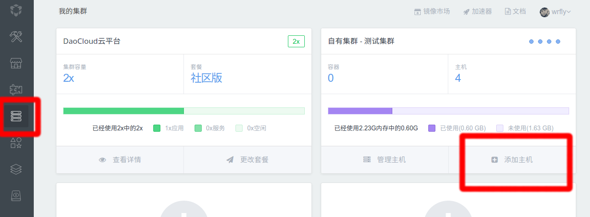

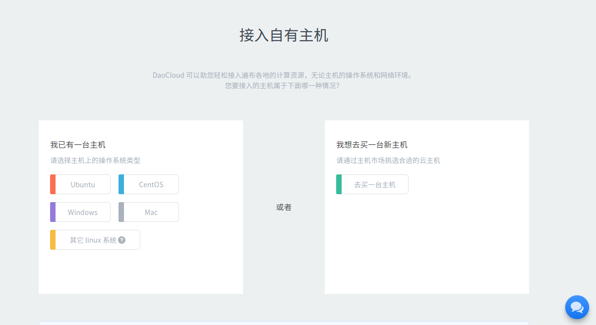

如果主机没有安装Docker，则需要在命令行里复制以下代码：

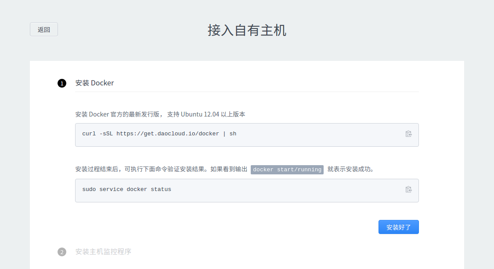

然后安装Monit程序：

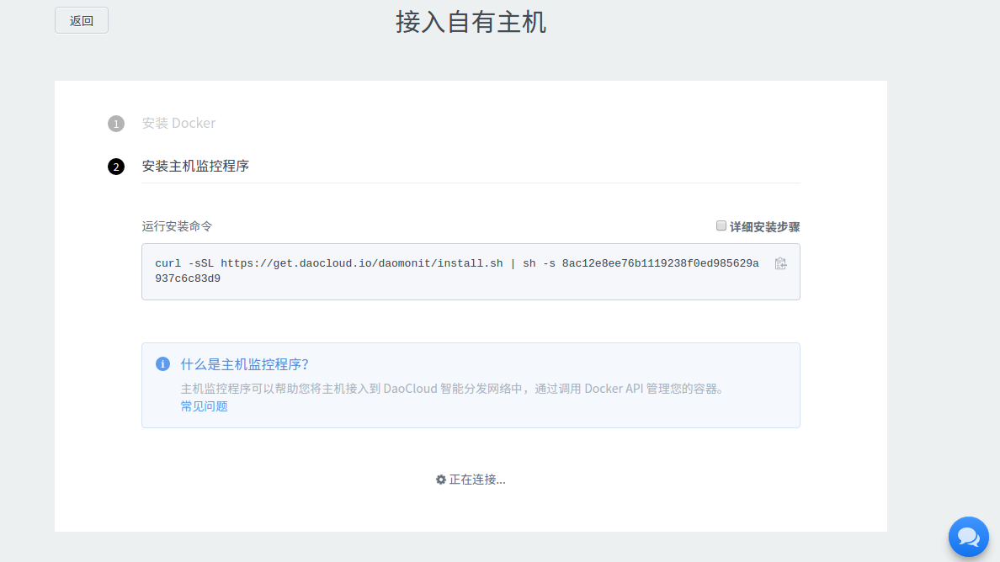

安装完成后，接入成功：

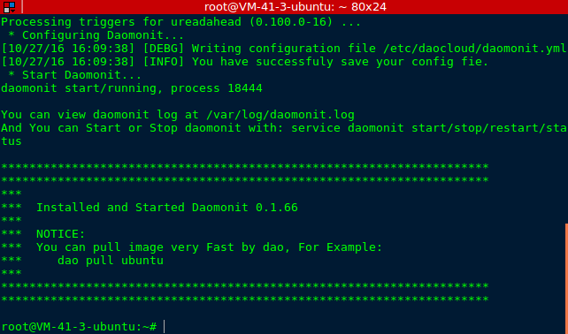

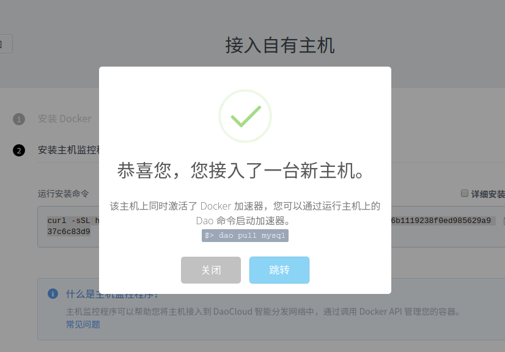

点击跳转，进入主机页面：

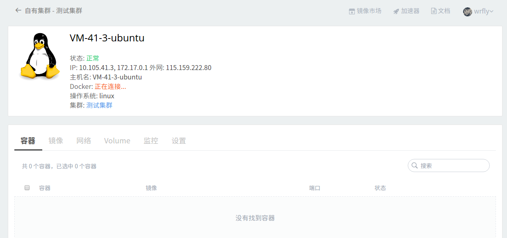

连接成功后：

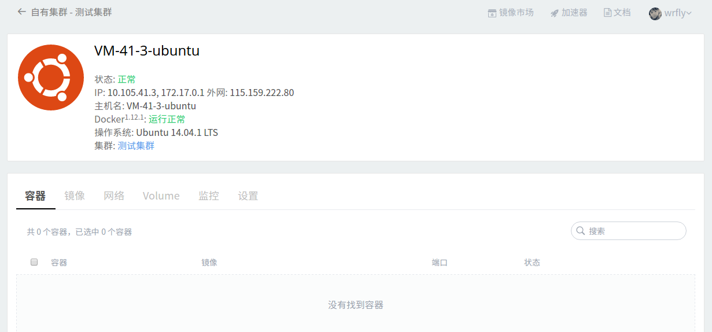

### 迁移应用

查看您的应用列表：

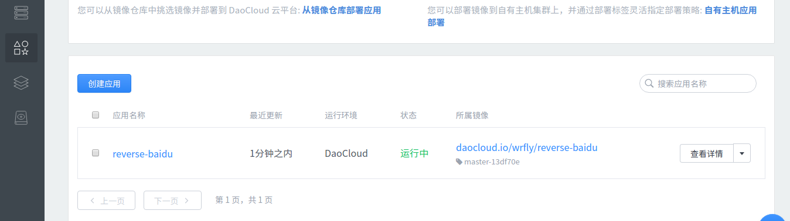

选择您需要迁移的应用，点击所属镜像：

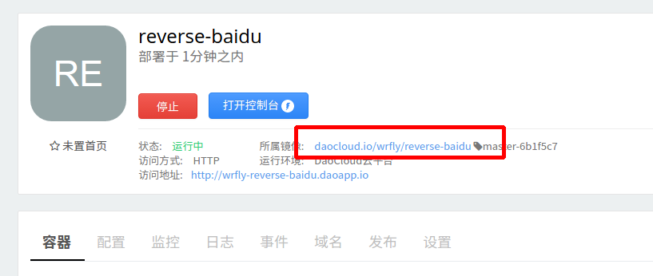

然后点击右上角的部署：

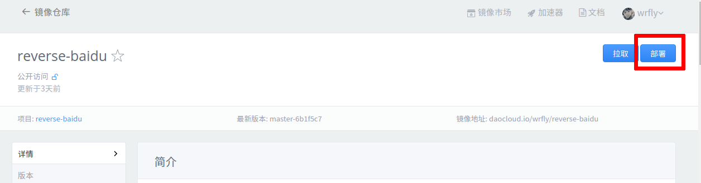

创建应用的时候选择我的主机：

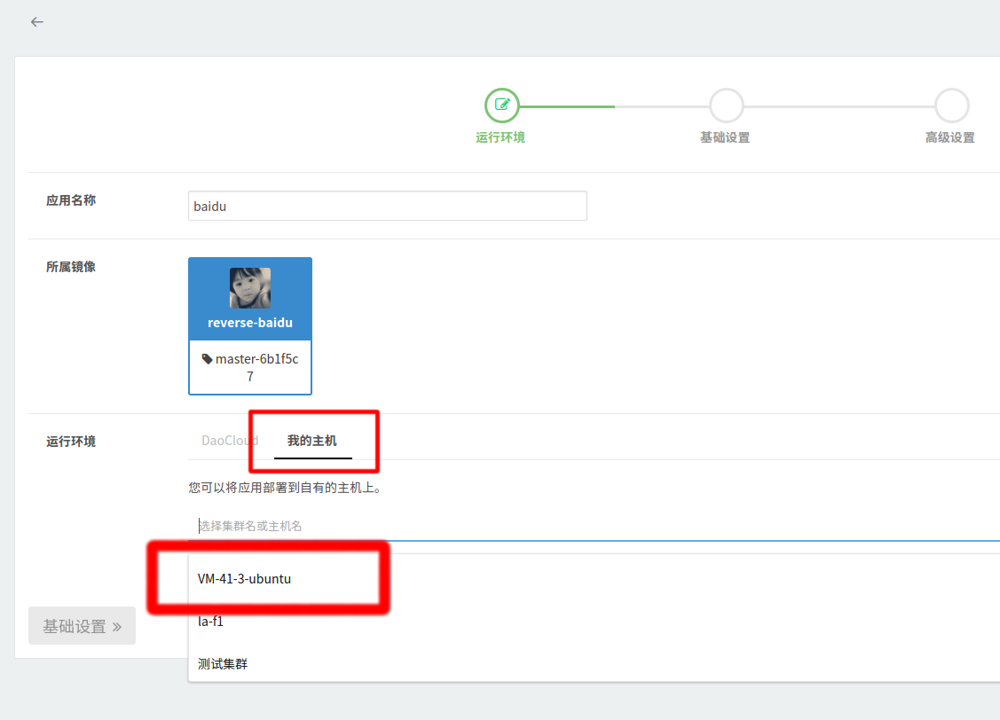

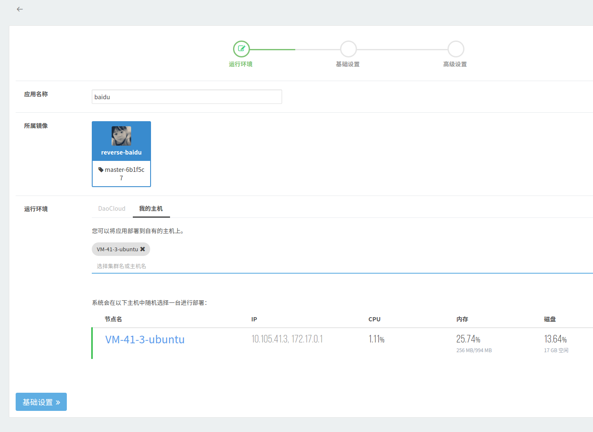

配置好基础设置：

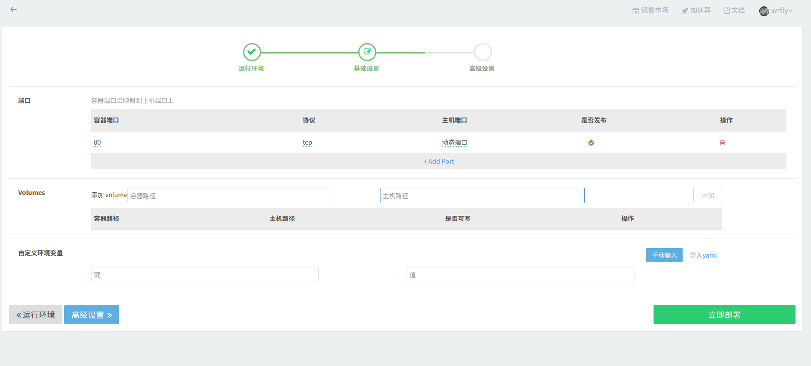

运行成功：

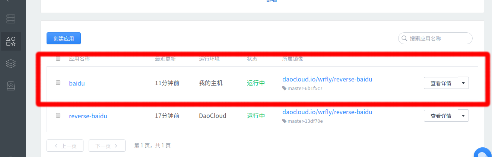